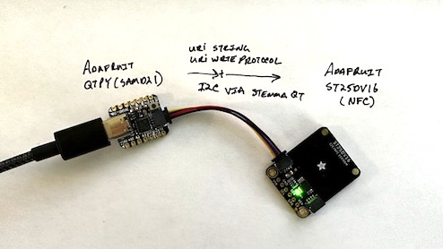

# Adafruit NFC ST25DV16 URL Write

 

 

This Arduino app tested and configured for an Adafruit QTPy (SAMD21) takes a string and write protocol and writes it to an Adafruit ST25dv16 NFC module.
[Note: After upload of the sketch/firmware the NFC is uploaded without confirmation (no blinking leds). Unplug the NFC and test after ~5 seconds)

### Parts Used
* Adafruit ST25DV16 - [https://www.adafruit.com/product/4701](https://www.adafruit.com/product/4701)
* Adafruit QTPy(SAMD21) - [https://www.adafruit.com/product/4600](https://www.adafruit.com/product/4600)
* Adafruit StemmaQT 50mm Cable - [https://www.adafruit.com/product/4399](https://www.adafruit.com/product/4399)
* USB-C male to USB-C male data cable

### IDE Used
* Arduino IDE 2.04 (MacOS - (M2 chip)) - https://www.arduino.cc/en/software
    * QTPY Arduino Setup Ref: (https://learn.adafruit.com/adafruit-qt-py/using-with-arduino-ide)[https://learn.adafruit.com/adafruit-qt-py/using-with-arduino-ide]   
