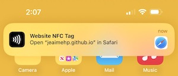

# Adafruit NFC ST25DV16 URL Write

 

 

This Arduino app tested and configured for an Adafruit QTPy (SAMD21) takes a string and write protocol and writes it to an Adafruit ST25dv16 NFC module.
[Note: After upload of the sketch/firmware the NFC is uploaded without confirmation (no blinking leds). Unplug the NFC and test after ~5 seconds)

